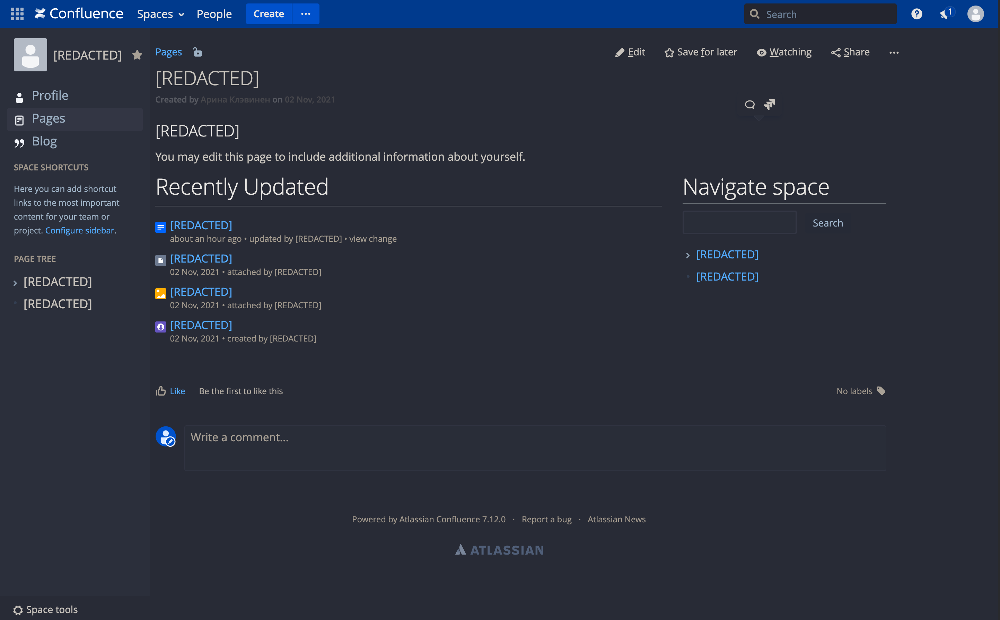
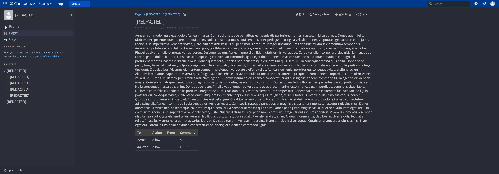

# Confluence dark CSS

This is combination of [Atlassian remixed theme by ESSENTIAL KAOS](https://github.com/essentialkaos/atlassian-remixed-theme) and [Dark Reader](https://github.com/darkreader/darkreader) generated CSS with my own fixes and page layout changes.

  
<strong>Image preview</strong>

## Files

* **confluence-dark.css:**  Basic CSS file. Contains imports and my own changes.
* **confluence-darkreader.css:** Dark Reader generated CSS.
* **confluence-dark-min.css:** all imports merged and CSSO optimized CSS.
* **userscript.js:**  Userscript that import `confluence-dark-min.css` from this repo.

## Userscript

1. Install [ViolentMonkey](https://violentmonkey.github.io/), [Firemonkey](https://addons.mozilla.org/firefox/addon/firemonkey/) or another userscript manager.
2. Add [`userscript.js`](https://raw.githubusercontent.com/azhinu/confluence-dark-theme/master/userscript.js) from this repo to userscript manager.
3. Add your Confluence domain to custom match rules.

## Compatibility

* Google Chrome:
  - CSS: ✔
  - Userscript: Tampermonkey ✔; ViolentMonkey ✔
* Min browser:
  - CSS: Untested ⚠️
  - Userscript: ❌

## Credites

* [ESSENTIAL KAOS](https://github.com/essentialkaos) for [Atlassian remixed theme](https://github.com/essentialkaos/atlassian-remixed-theme).
* [Dark Reader](https://github.com/darkreader/darkreader).
* [CSS Optimizer](https://github.com/css/csso) and [CSSO-cli](https://github.com/css/csso-cli).
* [Ankit Ahuja](https://github.com/ankit/) for [Stylebot](https://github.com/ankit/stylebot).
